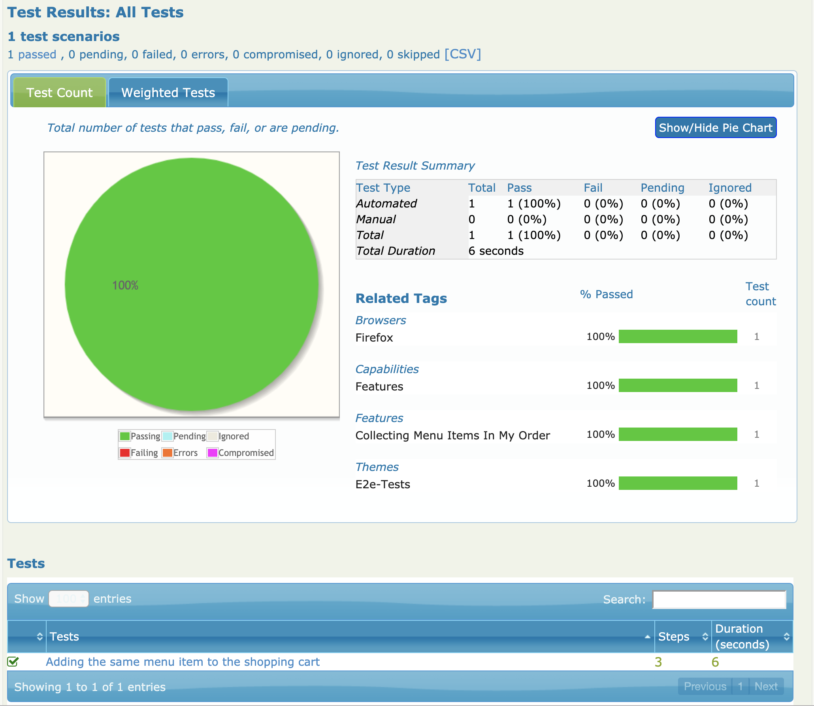
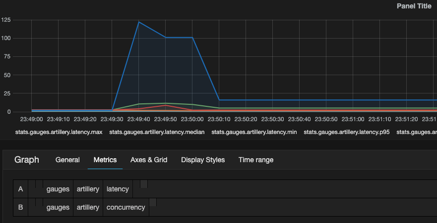

# AITM Automation test practice how to

## Prerequisites
 
From [project](https://bitbucket.org/itnove/aitm-2019) of previous sessions, update project
executing:  
 
 ```
 $> git submodule update --init --recursive
 ```
 
Another option if you've already installed docker is clone foodme:
 
 ```
 $> git clone https://bitbucket.org/xescuder/foodme
 ```

## Application start execution

Open a terminal, go to foodme folder and execute:

1. Start guest environment
    
   ```
   $> docker-compose build
   $> docker-compose up
   ```
    
1. Open a browser to http://localhost:3000


If a docker-compose up a message 'listen tcp 0.0.0.0:80: bind: address already in use' appears kill process bind to the port:

> lsof -n -i4TCP:80
> kill -9 PID

## BDD Test Automation

In order to execute BDD tests of our app we're going to use:

- [Cucumber.js](https://github.com/cucumber/cucumber-js)
- [Protractor](https://www.protractortest.org/#/)
- [Serenity](https://serenity-js.org/)


Below the folder **webapp** create a directory named **e2e-tests**.

### Protractor configuration

On file **protractor.conf.js**:

```javascript
const crew = require('serenity-js/lib/stage_crew');

exports.config = {
    baseUrl: 'http://app:3000',
    seleniumAddress: 'http://firefox-container:4444/wd/hub',


    allScriptsTimeout: 110000,

    // Framework definition - tells Protractor to use Serenity/JS
    framework: 'custom',
    frameworkPath: require.resolve('serenity-js'),

    // Serenity with cucumber

    serenity: {
        dialect: 'cucumber',
        crew:    [
            crew.serenityBDDReporter(),
            crew.photographer()
        ]
    },


    specs: [ 'e2e-tests/features/add_menu_item.feature' ],

    cucumberOpts: {
          require:    [           // loads step definitions:
              'e2e-tests/features/**/add_menu_item.steps.ts' // - defined using JavaScript
          ],
          format: 'pretty',               // enable console output
          compiler: 'ts:ts-node/register'
    },


    capabilities: {
          browserName: 'firefox',

           'moz:firefoxOptions': {
              args: [ "--headless" ]
            }
    },

    restartBrowserBetweenTests: false
};
```


### Feature definition

1. Below the **e2e-tests** folder create:

     - A subfolder **features**. This is the folder where we are going to create feature files. 
     - A subfolder **step_definitions**. This is where we glue the features with test implementation.

1. Create one feature file **add_menu_item.feature** with content:

       ```
        Feature: Collecting menu items in my order
        
          As a shop visitor
          I want to collect menu items in my order
          so that I can purchase multiple menu items at once
        
          Scenario: Adding the same menu item to the shopping cart
        
            Given that I have an order containing Chicken teriyaki from restaurant Robatayaki Hachi
            When I add the item Chicken teriyaki from restaurant Robatayaki Hachi to my order
            Then my order should contain 2 items of Chicken teriyaki
       ```

### Test implementation

Create the step definitions file **add_menu_item.steps.ts**

```javascript
'use strict';

var chai = require('chai');
var chaiAsPromised = require('chai-as-promised');

chai.use(chaiAsPromised);
var expect = chai.expect;

module.exports = function addAlreadyExistingItem() {

    this.Given(/^.*that I have an order containing (.*?) from restaurant (.*?)$/, async function(item, restaurant) {
    });

    this.When(/^.*I add the item (.*?) from restaurant (.*?) to my order$/, async function(item, restaurant)  {
    });

    this.Then(/^my order should contain (\d+) items of (.*?)$/, async function(numItems, item)  {
    });
};
```

#### Given step implementation

We're going to use [PageObject](https://martinfowler.com/bliki/PageObject.html) pattern.

1. Create subfolder **pages** inside folder **e2e-tests**
1. Create the start page file **start.page.js**:

    - Go to browser app and see what is the url we need to go    
    - Create a user function to do login, and define how to get to url

        ```javascript
        const StartPage = function() {
        
            const po = this;
            
            po.doLogin = async function (name, address) {
                await browser.manage().deleteAllCookies();
                await browser.get(browser.baseUrl + '/index.html#/customer');
            }
        
        };
    
        module.exports = new StartPage();
        ```
    
    - From browser inspect page to know how to locate the customerName, address
    and button and define locators using selenium/protractor factories:
    
        ```javascript
        const StartPage = function() {
        
            const po = this;
        
        
            po.name = by.id('customerName');
            po.address = by.id('address');
            po.loginBtn = by.css('.btn-primary');
        
            po.doLogin = async function (name, address) {
                await browser.manage().deleteAllCookies();
                await browser.get(browser.baseUrl + '/index.html#/customer');
        
            }
        
        };
        
        module.exports = new StartPage();
        ```

    - Finally define how to send data to the web components
    
        ```javascript
        podoLogin = async function (name, address) {
            ...
            await browser.element(po.name).sendKeys(name);
            await browser.element(po.address).sendKeys(address);
            await browser.element(po.loginBtn).click();    
        }
        ```

    - Do the connection of user action to the test implementation

        ```
        const startPage = require('../../pages/start.page');
        
        
        this.Given(/^.*that I have an order containing (.*?) from restaurant (.*?)$/, async function(item, restaurant) {
            await startPage.doLogin('Xavier', 'Yeees');       
        });
        ```
    
1. Create **home.page.js** file and reply previous steps but trying to define how to simulate
user action to select the restaurant passed as parameter from feature

    ```javascript
    const HomePage = function() {
    
        const po = this;
    
        po.linkRestaurant =  function (name) {
            return by.xpath("//td/a/b[contains(text(),'" + name + "')]");
        }
    
        po.goToRestaurant = async function(restaurant) {
            await browser.get(browser.baseUrl + '/index.html#')
            await browser.element(po.linkRestaurant(restaurant)).click();
        }
    };

    module.exports = new HomePage();
    ```

1. Create page **restaurant.page.js**:

    ```javascript   
    const RestaurantPage = function() {
    
        const po = this;
    
    
        po.menuList = by.css('fm-menu-list')
    
        po.menuItem = function (name) {
            return by.xpath("//a/span[1][contains(text(),'" + name + "')]");
        }
    
    
        po.addItem2Order = async function (name) {
            await browser.element(po.menuItem(name)).click();
        };
    
    
    };
    
    module.exports = new RestaurantPage();        
    ```    
    
1. Now we can define all Given step implementation:

    ```javascript
    this.Given(/^.*that I have an order containing (.*?) from restaurant (.*?)$/, async function(item, restaurant) {
        await startPage.doLogin('Xavier', 'Yeees');
        await homePage.goToRestaurant(restaurant);
        await restaurantPage.addItem2Order(item);
    });
    ```


Follow previous steps to get When and Then steps implementations.

Finally, we get a new file **order.page.js**:

```javascript
const OrderPage = function() {

    const po = this;

    po.getOrderItemQty = async function (itemName) {

        let items = await browser.element.all(by.repeater('item in cart.items')).filter(function (row) {
            return row.evaluate("item.name").then(function (name) {
                return name === itemName;
            });
        });

        let qty = await items[0].evaluate('item.qty');

        return parseInt(qty);
    }
};

module.exports = new OrderPage();
```    
In this case we are used protractor **by.repeater** to get all items in cart.


And the **add_menu_item.steps.ts** as:

```javascript
'use strict';

var chai = require('chai');
var chaiAsPromised = require('chai-as-promised');

chai.use(chaiAsPromised);
var expect = chai.expect;

const startPage = require('../../pages/start.page');
const homePage = require('../../pages/home.page');
const restaurantPage = require('../../pages/restaurant.page');
const orderPage = require('../../pages/order.page');

var logger = require('../../logger');

module.exports = function addAlreadyExistingItem() {

    this.setDefaultTimeout(60 * 1000);


    this.Given(/^.*that I have an order containing (.*?) from restaurant (.*?)$/, async function(item, restaurant) {
        await startPage.doLogin('Xavier', 'Yeees');
        await homePage.goToRestaurant(restaurant);
        await restaurantPage.addItem2Order(item);
    });

    this.When(/^.*I add the item (.*?) from restaurant (.*?) to my order$/, async function(item, restaurant)  {
        await homePage.goToRestaurant(restaurant);
        await restaurantPage.addItem2Order(item);
    });

    this.Then(/^my order should contain (\d+) items of (.*?)$/, async function(numItems, item)  {
       var qty = await orderPage.getOrderItemQty(item);
       expect(qty).to.equal(parseInt(numItems));
    });
};
``` 


### Test execution

Open a new terminal

1. Connect to container 'foodme_app'

    ```bash
    $> docker ps -a
    $> docker exec -u 0 -it CONTAINER_ID bash
    $> cd webapp
    ``` 

1. Execute tests

    ```bash
    $> npm run test:e2e
    ```

    Look at **target>site>serenity** folder what is the content of json file (test results).

1. Generate pretty report executing:

    ```bash
    $> npm run report
    ```
   
   Look **at **target>site>serenity** as a new **index.html** has been generated and a lot of files.
   
   Open in a browser the file index.html:
   
   
   
   

## Performance Testing


We'll use [artillery framework](https://artillery.io/docs/) and [Grafana](https://grafana.com/)

### Test scenario definition

1. Below **webapp** create a subfolder **performance-tests**
1. Create a file **order.yml**
1. Set the target to the app, plugins for graphite and timeout

      ```
      config:
      target: "http://app:3000"
    
      plugins:
        statsd:
          host: "graphite"
          port: 8125
          prefix: "artillery"
      tls:
        rejectUnauthorized: false
      http:
        timeout: 10
        pool: 10
      ```

1. Now, we are going to create the test scenario phases:

      ```
      phases:
        - duration: 5
          arrivalRate: 1
          rampTo: 50
          name: "Warm up of food at the end of UPC course"
    
        - duration: 10
          arrivalRate: 1
          name: "The last to arrive"
      ```
  
    We set a ramp-up of 5 seconds entering 1 user each second until we get 50 users
  
1. With payload we can define what data we want to inject for each user execution:
  
    **users.csv**
        
    ```  
    customerName;customerAddress
    Xavier Escudero;Badajoz 457, Barcelona
    ```
    
    **restaurants.csv**
    
    ```
    restaurantName
    Esther's German Saloon
    Robatayaki Hachi
    ```  

    **order.yml**
    
      ```
      payload:
        - path: "users.csv"
          fields:
            - "customerName"
            - "customerAddress"
          skipHeader: true
          delimiter: ";"
    
        - path: "restaurants.csv"
          fields:
            - "restaurantName"
          skipHeader: true
          delimiter: ";"
      ```
    
1. And finally define the scenario:

    ```    
    scenarios:
      - name: "Pedido simultáneo 50 usuarios"
        flow:
          - get:
              url: "/#/"
              form:
                name: "customerForm"
                customerName: "{{customerName}}"
                address: "{{customerAddress}}"
    
          - think: 5
    
          - get:
              url: "/"
              capture:
                xpath: "html/body/div/ng-view/div/div[2]/table/tbody/tr/td/a/b[contains(text(),'{{ restaurantName }}'"
                as: "restaurantId"
    
          - think: 1
          - get:
              url: "/#/menu/{restaurantId}"
              capture:
                  selector: "body > div > ng-view > div.row-fluid.ng-scope > div.span8.fm-panel.fm-menu-list > ul > li > a"
                  index: "random"
                  attr: "href"
                  as: "itemUrl"
          - get:
              url: "{{ itemUrl }"
    
    ```

### Test execution

Open a terminal and execute:   
    
```bash
$> docker exec -u 0 -it CONTAINER_ID bash 
$> artillery run order.yml
```
    
We can see at console output the summary of execution:

```
Elapsed time: 10 seconds
  Scenarios launched:  143
  Scenarios completed: 0
  Requests completed:  235
  RPS sent: 25.63
  Request latency:
    min: 0.9
    max: 16.6
    median: 1.7
    p95: 2.3
    p99: 4.4
  Codes:
    200: 235
```    

### Test execution monitoring


1. Go to **http://localhost:81**, and user root:root
1. Browse at Tree tab to **Metrics>stats>gauges>artillery**
1. Here we can see all metrics generated from test execution
1. Execute again tests (artillery run order.yml) and see how the graphic is updated (press refresh if not)

We could do it better with dashboards using Grafana:


1. Go to: http://localhost, and user admin:admin.
    - Visit http://localhost/datasources/new. Configure:

         * Name: 'upc-foodme'
         * Type: Graphite
         * Url: http://localhost:81
         * Press **Test Connection**

1. Go to Home and press **New** (to create a new Dashboard)
1. Press on created row (green line at top left) and select **Add Panel>Graph**
1. At tab **Metrics** select on combo **upc-foodme**
1. Select at **Metrics** tab and select metric:

    - gauges > artillery > latency > *
    
    Select at first *, as gauges may not appear, until you enter *       

1. Pressing **Query** button we can add another metric
    - gauges > artilley > concurrency
    

We can select from top the period of graph (for example to see the last 5 minutes)

Look and interpret the graph.
    

    

## Some useful commands

```bash
$> docker build -t node-docker .
```

```bash
$> docker run -p 49160:3000 -d node-docker
```

We can see all containers, also non running ones with:

```bash
$> docker ps -a
```

CONTAINER ID        IMAGE               COMMAND             CREATED             STATUS                     PORTS               NAMES
8bea21baaa25        node-docker         "npm start"         3 minutes ago       Exited (1) 3 minutes ago                       silly_ptolemy

Here we see execution has aborted, maybe because our code. We can see logs using the container id:

```bash
$> docker logs CONTAINER_ID
```

If everything is OK we'll see port forwarding in the console:

```bash
$> docker ps -a

CONTAINER ID        IMAGE               COMMAND             CREATED             STATUS              PORTS                     NAMES
40a03af93265        node-docker         "npm start"         5 seconds ago       Up 4 seconds        0.0.0.0:49160->8080/tcp   hardcore_lumiere
```

Remove container:

```bash
$> docker rm CONTAINER_ID -f
```

Remove image:

```bash
$> docker rmi IMAGEID -f
```

If we want to prune everything (stopped containers, all dangling images, ...):

```bash
$ docker system prune -a
$ docker container prune
```


We start with:
```bash
$> docker-compose up --build
```

Recreate with:

```bash
$> docker-compose up -d --force-recreate --build
$> docker-compose up
```

See contents in container:

```bash
$> docker exec -it CONTAINER_ID bash
```

Remove all containers:

> docker container stop $(docker container ls -aq)
Once all containers are stopped, you can remove them using the docker container rm command followed by the containers ID list.
> docker container rm $(docker container ls -aq)


